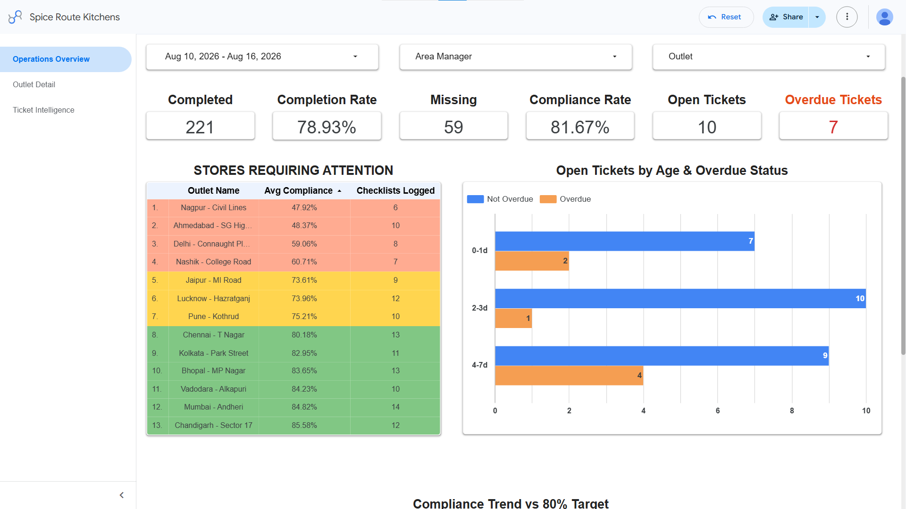

# Spice Route Kitchens — Analytical Rationale & Dashboards

This repository contains the deliverables for the **Spice Route Kitchens** operational analysis project. The project focuses on providing actionable insights for Area Managers and VP Operations through a live interactive dashboard and a weekly briefing report.

## Task Overview

The primary goal of this project is to address key operational questions for Spice Route Kitchens:
1. **Did scheduled work occur?**
2. **Where are unresolved operational issues concentrated?**
3. **Which outlets require intervention?**

### Key Deliverables

*   **Area Manager Dashboard:** A live, interactive dashboard built to combine scheduled-work completion, compliance, ticket backlog, and outlet-level prioritisation. It provides drill-down capabilities for daily monitoring and deep-dive investigations. Ad-hoc forms (like Kitchen Equipment Audit and Store Issue Report) were deliberately excluded from completion-rate KPIs to avoid misrepresenting execution quality.
*   **VP Operations Weekly Brief:** A recurring weekly report designed for leadership. It focuses on recurring outlet underperformance, ageing ticket backlog, and issue patterns. The report is designed to prioritize management action rather than provide a descriptive status summary.

## Live Dashboard

You can access the live Area Manager Dashboard here:
**[Open Area Manager Dashboard &rarr;](https://datastudio.google.com/reporting/28637db5-db08-487f-9dd1-27230863bb20)**

## Reports

*   **VP Operations Weekly Briefs:**
    *   [3-9 August Spice Route Kitchens (PDF)](3-9%20%20August%20Spice_Route_Kitchens.pdf)
    *   [10-16 August Spice Route Kitchens (PDF)](10-16%20August%20Spice_Route_Kitchens.pdf)
*   **Analytical Rationale:**
    *   [Rationale Document (HTML)](Rationale.html) | [(PDF)](Rationale.pdf)
*   **VP Report Document:**
    *   [VP Report (HTML)](VP_Report.html) | [(PDF)](VP_Report.pdf)

## Screenshots

### 1. Area Manager Dashboard (Looker Studio)
*(Place your dashboard screenshot here)*

### 2. VP Operations Weekly Brief
*(Place your weekly brief screenshot here)*

### 3. Analytical Rationale Document
*(Place your rationale document screenshot here)*

## Data Sources

The analysis is powered by the following datasets included in the `Data/` directory:
*   `form.csv` & `form_details.csv`
*   `form_submissions.csv` & `submission_master.csv`
*   `outlets.csv`
*   `tickets.csv` & `ticket_master.csv`
*   `users.csv`
*   `calendar_completion.csv`

## Design & Theming

The visual theme and typography of the reports take direct inspiration from the Linemate website and the original Task 1 brief document. This includes the use of the signature coral-orange accent color, clean sans-serif typography, and a subtle grid background to seamlessly align the analytical deliverables with Linemate's core brand identity.
