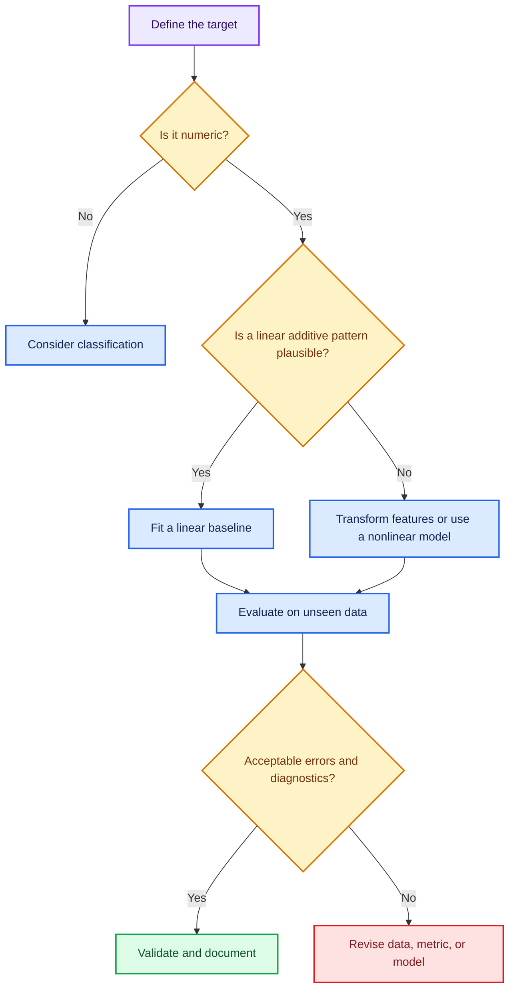
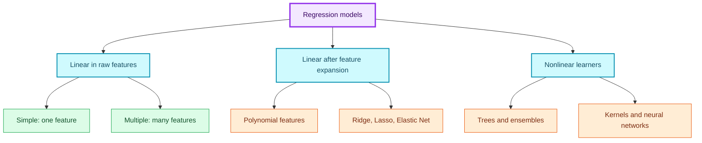
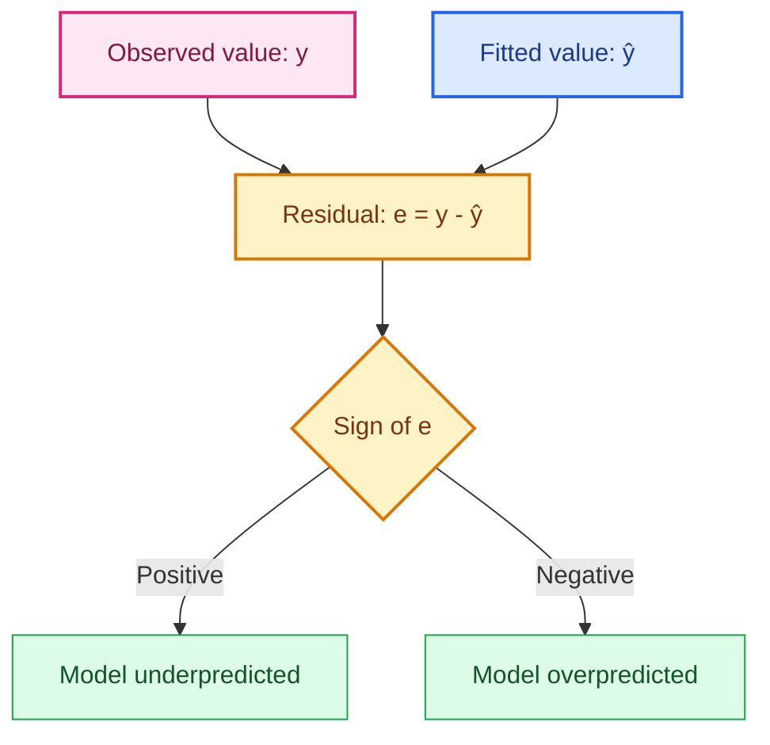
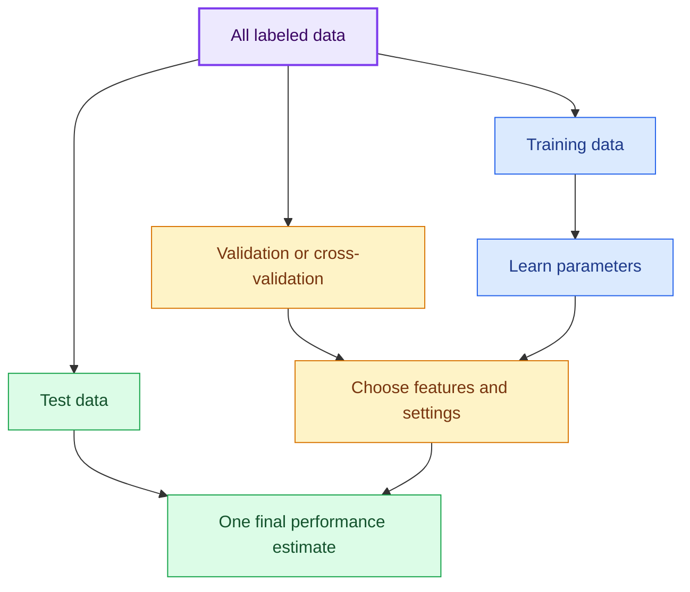
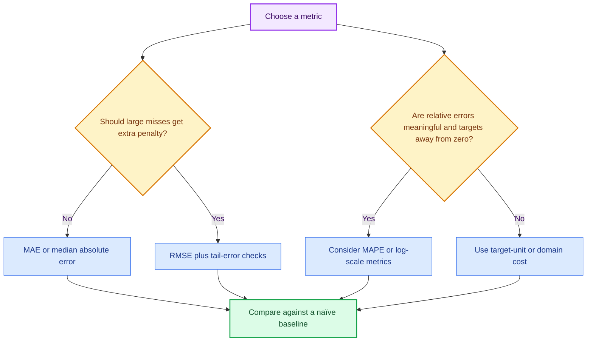
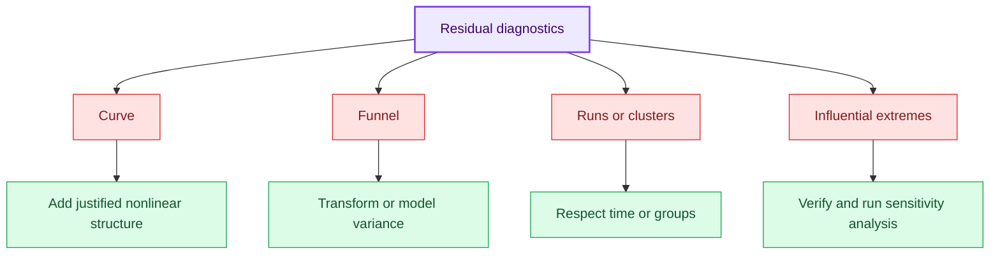

# 2. Regression

> Expanded from `1 regression.ipynb`. The notebook's numerical example is retained, its outputs are verified, and important mathematical and implementation subtleties are corrected.

<div class="note-card" markdown="1">
## 1. Learning goals

After these notes, you should be able to:

- recognize a regression task and distinguish it from classification;
- explain features, targets, predictions, residuals, slopes, and intercepts;
- distinguish simple, multiple, polynomial, and regularized regression;
- describe ordinary least squares algebraically and geometrically;
- calculate and interpret MAE, MSE, RMSE, and $R^2$;
- select a metric based on the real cost of mistakes;
- fit and test a model without leaking information;
- use residuals to investigate model assumptions;
- explain each important line in the notebook's Python workflow.
</div>

<div class="note-card" markdown="1">
## 2. What, why, and when

### What is regression?

Regression is a **supervised-learning task family** in which one or more inputs are used to predict a numerical output:

$$
f:\mathbb{R}^{p}\rightarrow\mathbb{R},
\qquad
\hat y=f(\mathbf{x}).
$$

- $\mathbf{x}=(x_1,\ldots,x_p)$ is a feature vector.
- $y$ is the observed target.
- $\hat y$, pronounced "y-hat," is the prediction.

Regression is not one algorithm. Linear regression, regression trees, random forests, gradient boosting, support-vector regression, and neural networks can all solve regression problems.

| Question | Regression | Classification |
|---|---|---|
| Output | Numerical quantity | Category or class probability |
| Example | House price = ₹52.4 lakh | Loan = approved/not approved |
| Metrics | MAE, RMSE, $R^2$ | Accuracy, recall, F1, log loss |

A number is not automatically a regression target. Labels encoded as $0,1,2$ still represent classification if those numbers are merely category names.

### Why use regression?

Regression supports two related goals:

1. **Prediction:** estimate an unknown numeric outcome.
2. **Explanation:** estimate how the expected target changes with features.

These are not identical. A simple model may be preferred for interpretation, while a nonlinear ensemble may predict better. Strong prediction or association does not by itself demonstrate causation.

### When is linear regression useful?

Use it as a serious model or baseline when:

- the target is numeric;
- an approximately additive relationship is plausible;
- coefficient interpretation matters;
- a transparent and fast baseline is useful;
- extrapolation will be limited and defensible.

Revise the features, loss, or model when:

- the mean relationship bends strongly;
- interactions dominate;
- a few outliers control the fit;
- error variance changes greatly with prediction size;
- important time, group, or spatial dependence is ignored;
- the target needs a specialized distribution, such as counts or proportions.



### Examples

| Domain | Features ($X$) | Target ($y$) | Decision supported |
|---|---|---|---|
| Housing | area, rooms, age | sale price | Set a price range |
| Energy | weather, occupancy, hour | demand | Plan capacity |
| Healthcare | age, procedures, history | cost | Plan resources |
| Manufacturing | speed, heat, material | defect size | Adjust settings |

For stock prices, a random row split is normally unsuitable because time order matters. Use time-based validation and domain-aware baselines.
</div>

<div class="note-card" markdown="1">
## 3. Regression vocabulary

For $n$ rows and $p$ features:

| Term | Symbol | Meaning |
|---|---:|---|
| Observation | $i$ | One row |
| Feature | $x_j$ | An input column |
| Feature vector | $\mathbf{x}_i$ | All inputs for row $i$ |
| Target | $y_i$ | Observed output |
| Prediction | $\hat y_i$ | Model-estimated output |
| Residual | $e_i=y_i-\hat y_i$ | Observed minus predicted |
| Coefficient | $\beta_j$ | Feature weight |
| Intercept | $\beta_0$ | Prediction when modeled features equal zero |

An **error** is theoretically the difference from the unknown population relationship. A **residual** is the observed, fitted sample equivalent. Machine-learning explanations often use the words loosely, but statistics distinguishes them.

### Array shapes

$$
X\in\mathbb{R}^{n\times p},\quad
y\in\mathbb{R}^{n},\quad
\boldsymbol{\beta}\in\mathbb{R}^{p}.
$$

Even one feature is normally passed to scikit-learn as a 2-D matrix with shape $(n,1)$. This explains the notebook's `X = np.random.rand(100, 1)`.
</div>

<div class="note-card" markdown="1">
## 4. Regression model families



### 4.1 Simple linear regression

$$
\hat y=\beta_0+\beta_1x.
$$

Exactly one feature predicts the target. Example: price from area alone.

### 4.2 Multiple linear regression

$$
\hat y=\beta_0+\beta_1x_1+\cdots+\beta_px_p.
$$

With price, area, rooms, and age, $\beta_{\text{area}}$ is the modeled price change for one additional area unit **while holding the other included variables fixed**. This is conditional association, not automatically a causal effect.

### 4.3 Polynomial regression

$$
\hat y=\beta_0+\beta_1x+\beta_2x^2+\beta_3x^3.
$$

The graph can curve, but the model remains **linear in its coefficients**. It is ordinary linear regression applied to transformed features $x,x^2,x^3$. High degrees can overfit and extrapolate wildly, so choose the degree with validation.

### 4.4 Regularized regression

Regularization controls coefficient size and model variance.

#### Ridge

$$
\min_{\boldsymbol{\beta}}
\left[
\frac1n\sum_i(y_i-\hat y_i)^2
+\lambda\sum_j\beta_j^2
\right].
$$

Ridge shrinks coefficients toward zero and is often helpful with correlated predictors.

#### Lasso

$$
\min_{\boldsymbol{\beta}}
\left[
\frac1n\sum_i(y_i-\hat y_i)^2
+\lambda\sum_j|\beta_j|
\right].
$$

Lasso can set some coefficients exactly to zero.

#### Elastic Net

$$
\min_{\boldsymbol{\beta}}
\left[
\frac{1}{2n}\lVert y-X\boldsymbol{\beta}\rVert_2^2+
\lambda\left(\rho\lVert\boldsymbol{\beta}\rVert_1+
\frac{1-\rho}{2}\lVert\boldsymbol{\beta}\rVert_2^2\right)
\right].
$$

It blends Lasso and Ridge. Scale numeric features before regularization so feature units do not arbitrarily control penalty strength.
</div>

<div class="note-card" markdown="1">
## 5. Linear regression intuition

The notebook creates:

$$
y=3x+5+\varepsilon,
$$

where $\varepsilon$ is random noise. The learner sees only the noisy points and tries to recover a slope near $3$ and intercept near $5$.

### Slope

$$
\beta_1=\frac{\Delta\hat y}{\Delta x}.
$$

If $\beta_1=2.92$, the predicted target increases by about $2.92$ units when $x$ increases by one unit.

### Intercept

$$
\hat y\big|_{x=0}=\beta_0.
$$

The intercept is not always meaningful. If $x=0$ is impossible or far outside the observed range, interpreting it is extrapolation.

### Residual

$$
e_i=y_i-\hat y_i.
$$

- $e_i>0$: underprediction;
- $e_i<0$: overprediction;
- $e_i=0$: exact prediction.



Standard regression minimizes vertical differences because the setup treats $x$ as observed and uncertainty as acting mainly in $y$. If both axes contain material measurement error, an errors-in-variables or orthogonal method may be better.
</div>

<div class="note-card" markdown="1">
## 6. How the best line is found

### 6.1 Least squares

$$
\operatorname{SSE}=\sum_{i=1}^{n}(y_i-\hat y_i)^2,
\qquad
\operatorname{MSE}=\frac1n\sum_{i=1}^{n}(y_i-\hat y_i)^2.
$$

OLS chooses coefficients with the smallest SSE. Dividing by $n$, $2n$, or not dividing does not change the minimizer; it only rescales the objective and gradient.

Why square residuals?

- signs cannot cancel;
- large mistakes receive more weight;
- the objective is smooth;
- linear least squares produces a convex quadratic.

Squared loss is also the maximum-likelihood loss when independent errors are normally distributed with constant variance.

### 6.2 Closed-form simple-regression solution

$$
\hat\beta_1=
\frac{\sum_i(x_i-\bar x)(y_i-\bar y)}
{\sum_i(x_i-\bar x)^2},
\qquad
\hat\beta_0=\bar y-\hat\beta_1\bar x.
$$

The numerator measures co-movement; the denominator measures variation in $x$. Equivalently:

$$
\hat\beta_1=r_{xy}\frac{s_y}{s_x}.
$$

The fitted line with an intercept passes through $(\bar x,\bar y)$.

### 6.3 Matrix form

With a column of ones for the intercept:

$$
\hat{\boldsymbol{\beta}}=(X^\top X)^{-1}X^\top y.
$$

This textbook expression assumes invertibility. Software should not explicitly calculate that inverse. QR, singular-value decomposition, `numpy.linalg.lstsq`, and pseudoinverses are more stable and can handle rank deficiency.

For $X$ shaped $(n,p)$, SVD-based least squares commonly costs $O(np^2)$ when $n\ge p$. The notebook statement "matrix inversion is $O(n^3)$" mixes sample and feature dimensions.

### 6.4 Gradient descent

For

$$
J(\boldsymbol{\beta})=\frac1n\lVert y-X\boldsymbol{\beta}\rVert_2^2,
$$

$$
\nabla J=-\frac{2}{n}X^\top(y-X\boldsymbol{\beta}),
\qquad
\boldsymbol{\beta}^{(t+1)}
=\boldsymbol{\beta}^{(t)}-\alpha\nabla J.
$$

Ordinary linear least-squares loss is convex. A tiny learning rate mainly converges slowly; it is not trapped by local minima. A very large rate can overshoot and diverge.

| Method | Strength | Limitation | Typical use |
|---|---|---|---|
| QR/SVD least squares | Accurate; no learning rate | Costly for huge dense data | Small/medium dense data |
| Batch GD | Smooth trajectory | Full pass per update | Large differentiable problems |
| SGD | Cheap online updates | Noisy path | Streaming or huge data |
| Mini-batch GD | Vectorized and scalable | Requires tuning | Large-scale learning |
</div>

<div class="note-card" markdown="1">
## 7. Train, validation, and test data

The notebook creates a reproducible 80/20 split:

```python
X_train, X_test, y_train, y_test = train_test_split(
    X,
    y,
    test_size=0.20,   # Keep 20% unseen for evaluation.
    random_state=42,  # Reproduce this exact split.
)
```

A model can fit noise. Testing on training rows produces an optimistic estimate of future performance.



In production:

- tune with validation data or cross-validation;
- leave test data untouched until the end;
- fit scaling, imputation, and feature selection inside training folds;
- preserve time order for forecasting;
- split by patient, customer, machine, or location when rows within a group are related.
</div>

<div class="note-card" markdown="1">
## 8. Evaluation metrics

Let $e_i=y_i-\hat y_i$.

### 8.1 MAE

$$
\operatorname{MAE}=\frac1n\sum_i|e_i|.
$$

It is the mean absolute miss in target units. It is easy to explain and less dominated by extremes than squared metrics.

### 8.2 MSE

$$
\operatorname{MSE}=\frac1n\sum_i e_i^2.
$$

Large errors receive disproportionate weight. Its units are squared, which makes direct interpretation harder.

### 8.3 RMSE

$$
\operatorname{RMSE}=\sqrt{\frac1n\sum_i e_i^2}.
$$

RMSE is in target units while remaining sensitive to large errors. Always:

$$
\operatorname{RMSE}\ge\operatorname{MAE}.
$$

### 8.4 Coefficient of determination

$$
R^2=1-\frac{\sum_i(y_i-\hat y_i)^2}
{\sum_i(y_i-\bar y)^2}
=1-\frac{\operatorname{SSE}}{\operatorname{SST}}.
$$

- $R^2=1$: perfect predictions.
- $R^2=0$: equal squared-error performance to the evaluation-set mean.
- $R^2<0$: worse than that baseline.

$R^2=0.97$ does not mean "97% accurate." It does not prove causality, uncertainty calibration, or business usefulness.

### 8.5 Adjusted $R^2$

$$
\bar R^2=1-(1-R^2)\frac{n-1}{n-p-1}.
$$

Adjusted $R^2$ penalizes adding predictors that produce insufficient improvement. Out-of-sample validation remains more important for prediction.

### 8.6 MAPE caution

$$
\operatorname{MAPE}=\frac{100}{n}\sum_i
\left|\frac{y_i-\hat y_i}{y_i}\right|.
$$

MAPE is undefined at zero, unstable near zero, asymmetric, and inappropriate for negative targets. Scikit-learn returns a relative value rather than an already multiplied percentage.



No single metric is universally best. Translate the real cost of underprediction, overprediction, and large tail errors into the evaluation plan.
</div>

<div class="note-card" markdown="1">
## 9. Assumptions and diagnostics

The assumptions matter especially for coefficient inference and uncertainty intervals, but violations can also hurt prediction.

### 9.1 Linear conditional mean

$$
E[Y\mid X]=\beta_0+\sum_j\beta_jx_j.
$$

A curved residual pattern suggests missing nonlinear structure. Consider justified polynomial, spline, interaction, or transformed features.

### 9.2 Independent or appropriately modeled errors

Residuals should not have unmodeled time, group, or spatial dependence. Check them in sequence and by group; use structured splitting and a suitable model.

### 9.3 Constant conditional variance

$$
\operatorname{Var}(\varepsilon_i\mid X_i)=\sigma^2.
$$

A funnel-shaped residual plot indicates heteroscedasticity. Consider transformations, weighted regression, variance-aware models, or robust standard errors.

### 9.4 No perfect multicollinearity

Exact linear dependence makes coefficients non-unique. Near-dependence makes individual coefficients unstable. Inspect domain redundancy, correlations, singular values, or variance inflation factors; consider Ridge.

### 9.5 Normal residuals for classical small-sample inference

Normality is not required for OLS coefficients to exist. It supports exact small-sample tests and intervals under the classical model. Use Q–Q plots and investigate heavy tails rather than deleting inconvenient cases.

### 9.6 Outliers, leverage, and influence

- **Outlier:** unusual target after considering features.
- **High leverage:** unusual feature values.
- **Influential point:** materially changes the fit.

Cook's distance and leverage diagnostics can help separate them.


</div>

<div class="note-card" markdown="1">
## 10. Fully commented implementation

This version keeps the notebook's synthetic process, adds a baseline, and diagnoses held-out residuals separately.

```python
import numpy as np
import pandas as pd
import matplotlib.pyplot as plt
from sklearn.dummy import DummyRegressor
from sklearn.linear_model import LinearRegression
from sklearn.metrics import (
    mean_absolute_error,
    mean_squared_error,
    root_mean_squared_error,
    r2_score,
)
from sklearn.model_selection import train_test_split

# 1. Reproduce the notebook's synthetic data without changing global RNG state.
rng = np.random.RandomState(42)
X = rng.rand(100, 1) * 10       # 100 rows, one feature, values in [0, 10).
noise = rng.randn(100) * 2       # Gaussian noise with standard deviation 2.
y = 3 * X[:, 0] + 5 + noise     # Hidden process: y = 3x + 5 + noise.

df = pd.DataFrame({"Feature": X[:, 0], "Target": y})
print(df.head())
print(df.describe())

# 2. Split before fitting so test rows cannot influence the parameters.
X_train, X_test, y_train, y_test = train_test_split(
    X,
    y,
    test_size=0.20,
    random_state=42,
)

# 3. Fit a naïve mean baseline and the OLS model.
baseline = DummyRegressor(strategy="mean")
baseline.fit(X_train, y_train)   # Learns only the mean training target.

model = LinearRegression()
model.fit(X_train, y_train)      # Learns one slope and one intercept.

print(f"Slope: {model.coef_[0]:.4f}")
print(f"Intercept: {model.intercept_:.4f}")

# 4. Predict only after fitting is complete.
baseline_pred = baseline.predict(X_test)
y_test_pred = model.predict(X_test)

def regression_report(y_true, y_pred):
    return {
        "MAE": mean_absolute_error(y_true, y_pred),
        "MSE": mean_squared_error(y_true, y_pred),
        "RMSE": root_mean_squared_error(y_true, y_pred),
        "R2": r2_score(y_true, y_pred),
    }

print("Baseline:", regression_report(y_test, baseline_pred))
print("Linear model:", regression_report(y_test, y_test_pred))

# 5. Held-out residuals reveal the direction and structure of errors.
test_residuals = y_test - y_test_pred
fig, axes = plt.subplots(1, 2, figsize=(12, 4))

axes[0].scatter(y_test_pred, test_residuals, alpha=0.75)
axes[0].axhline(0, color="red", linestyle="--")
axes[0].set(
    xlabel="Held-out prediction",
    ylabel="Residual (actual - prediction)",
    title="Residuals on unseen data",
)

lower = min(y_test.min(), y_test_pred.min())
upper = max(y_test.max(), y_test_pred.max())
axes[1].scatter(y_test, y_test_pred, alpha=0.75)
axes[1].plot([lower, upper], [lower, upper], "r--", label="Perfect")
axes[1].set(
    xlabel="Actual target",
    ylabel="Predicted target",
    title="Actual versus predicted",
)
axes[1].legend()
plt.tight_layout()
plt.show()

# 6. predict() expects one row per case and one column per feature.
new_x = np.array([[2.5], [5.5], [8.0]])
for x_value, prediction in zip(new_x[:, 0], model.predict(new_x)):
    print(f"x={x_value:.1f} -> predicted y={prediction:.2f}")
```

### Why important lines exist

| Code | What | Why |
|---|---|---|
| `RandomState(42)` | Reproduces the data | Comparisons use identical samples |
| `X[:, 0]` | Selects the one feature as 1-D | Keeps target arithmetic simple |
| `train_test_split` | Reserves unseen rows | Estimates generalization |
| `DummyRegressor` | Predicts training mean | Gives a minimum baseline |
| `fit(X_train, y_train)` | Learns parameters | Test information stays isolated |
| `y_test - y_test_pred` | Calculates residuals | Retains direction of each miss |

### Stable OLS instead of an explicit inverse

```python
def stable_ols_with_intercept(X, y):
    X = np.asarray(X, dtype=float)
    y = np.asarray(y, dtype=float)

    # A ones column makes beta[0] the intercept.
    design = np.column_stack([np.ones(X.shape[0]), X])

    # lstsq uses stable linear algebra and handles rank deficiency.
    beta, residual_sums, rank, singular_values = np.linalg.lstsq(
        design,
        y,
        rcond=None,
    )
    return beta, rank, singular_values

beta, rank, singular_values = stable_ols_with_intercept(X, y)
print(beta)  # [intercept, slope] ≈ [5.4302, 2.9080]
```
</div>

<div class="note-card" markdown="1">
## 11. Interpreting the notebook results

The model trained on 80 rows finds:

$$
\hat y=5.2858+2.9197x.
$$

The hidden process was $5+3x+\varepsilon$, so the estimates are close but not exact because the sample contains random noise.

At $x=5.5$:

$$
\hat y=5.2858+2.9197(5.5)\approx21.34.
$$

### Verified test results

| Metric | Value | Meaning |
|---|---:|---|
| MAE | 1.1827 | Average absolute miss is about 1.18 units |
| MSE | 2.6148 | Average squared miss |
| RMSE | 1.6170 | Large-error-sensitive miss in target units |
| $R^2$ | 0.9686 | Strong improvement over the mean baseline |

Test performance is slightly better than training performance in this split. A randomly selected test subset can simply be easier; this alone does not imply leakage.

OLS fitted to all 100 rows gives:

$$
\hat y=5.4302+2.9080x.
$$

It differs because it uses 20 additional rows. Compare coefficients only when fitted on the same observations.

The test mean-baseline RMSE is about $9.16$, compared with $1.62$ for the line. That baseline makes the improvement concrete.
</div>

<div class="note-card" markdown="1">
## 12. Corrections and pitfalls

| Misconception | Correct understanding |
|---|---|
| Regression is one algorithm | It is a task family |
| Polynomial regression is nonlinear in everything | It is nonlinear in $x$, linear in coefficients |
| The intercept is always meaningful | Only when zero is meaningful and defensible |
| $R^2=0.97$ means 97% accurate | $R^2$ is relative squared-error improvement |
| OLS requires `inv(X.T @ X)` | Use QR/SVD/`lstsq` for numerical stability |
| Least-squares complexity is simply $O(n^3)$ | It depends on rows and features; commonly $O(np^2)$ for $n\ge p$ |
| Tiny learning rates get stuck in local minima | OLS loss is convex; tiny steps are mainly slow |
| More features always help | Training fit improves, but test performance can worsen |
| Correlation or a coefficient proves causation | Confounding and selection can create associations |
| Random splitting always works | Time and grouped data require structured splits |

### Leakage examples

- scaling before splitting;
- selecting features using test correlations;
- imputing missing values with all rows;
- repeatedly using test performance to tune;
- putting observations from the same entity on both sides.

Use a scikit-learn `Pipeline` so preprocessing is fitted inside training folds.
</div>

<div class="note-card" markdown="1">
## 13. Practice questions with answers

1. **What defines a regression task?**  
   The model predicts a numerical quantity.

2. **What is a residual?**  
   $e_i=y_i-\hat y_i$.

3. **If $e_i=-4$, what happened?**  
   The model overpredicted by 4.

4. **Why square residuals?**  
   To prevent sign cancellation, emphasize large errors, and obtain a smooth convex objective.

5. **Does slope $3$ prove causation?**  
   No; it is a modeled association unless a causal design justifies the claim.

6. **Why can an intercept be meaningless?**  
   Zero may be impossible or outside the data range.

7. **Why can test $R^2$ be negative?**  
   The predictions can be worse than a mean baseline.

8. **Why is RMSE at least MAE?**  
   Squaring gives larger absolute errors more weight.

9. **Why learn preprocessing only from training rows?**  
   Test-derived information would leak into model development.

10. **What does a U-shaped residual pattern suggest?**  
    Missing curvature.

11. **What does a funnel suggest?**  
    Non-constant conditional variance.

12. **Why can multicollinearity hurt interpretation?**  
    Similar predictions can arise from unstable combinations of coefficients.

13. **Why scale before Ridge or Lasso?**  
    The penalty acts on coefficient size, which depends on units.

14. **Actual values are $[2,4]$, predictions are $[3,6]$. Find MAE.**  
    $(1+2)/2=1.5$.

15. **For the same data, find MSE and RMSE.**  
    MSE $=(1^2+2^2)/2=2.5$; RMSE $=\sqrt{2.5}\approx1.581$.

16. **If SSE $=20$ and SST $=100$, find $R^2$.**  
    $1-20/100=0.8$.

17. **For $\hat y=5+3x$, predict at $x=4$.**  
    $17$.

18. **If the observed value is 14, find the residual.**  
    $14-17=-3$, an overprediction of 3.

### Coding challenges

19. Add five-fold cross-validation and summarize the score distribution.
20. Add $x^2$ and test whether held-out RMSE improves.
21. Inject one target outlier and compare MAE with RMSE.
22. Build two correlated features and compare OLS with Ridge.
23. Wrap scaling and Ridge in a `Pipeline`.
24. Repeat the split with 50 seeds and plot test $R^2$.
</div>

<div class="note-card" markdown="1">
## 14. Cheat sheet and fun facts

| Item | Formula or rule |
|---|---|
| Simple model | $\hat y=\beta_0+\beta_1x$ |
| Multiple model | $\hat y=\beta_0+\sum_j\beta_jx_j$ |
| Residual | $e_i=y_i-\hat y_i$ |
| OLS | $\min_\beta\sum_i e_i^2$ |
| Slope | $\hat\beta_1=\frac{\sum(x_i-\bar x)(y_i-\bar y)}{\sum(x_i-\bar x)^2}$ |
| Intercept | $\hat\beta_0=\bar y-\hat\beta_1\bar x$ |
| MAE | $\frac1n\sum|e_i|$ |
| RMSE | $\sqrt{\frac1n\sum e_i^2}$ |
| $R^2$ | $1-\text{SSE}/\text{SST}$ |
| Ridge | Adds $\lambda\sum\beta_j^2$ |
| Lasso | Adds $\lambda\sum|\beta_j|$ |

### Fun facts

- An OLS line with an intercept passes through $(\bar x,\bar y)$.
- Training residuals sum to zero when an intercept is fitted.
- In simple OLS with an intercept, training $R^2=r_{xy}^2$.
- Adding a feature cannot reduce ordinary training $R^2$, even when that feature is noise.
- Scaling $x$ changes its coefficient but does not change predictions when the transformation is applied consistently.
- "Regression" came from Francis Galton's "regression toward the mean."
- Excellent global $R^2$ can hide serious bias for a small subgroup.
</div>

## Verified API references

- [scikit-learn: LinearRegression](https://scikit-learn.org/stable/modules/generated/sklearn.linear_model.LinearRegression.html)
- [scikit-learn: Linear models and OLS complexity](https://scikit-learn.org/stable/modules/linear_model.html)
- [scikit-learn: Regression metrics](https://scikit-learn.org/stable/modules/model_evaluation.html#regression-metrics)
