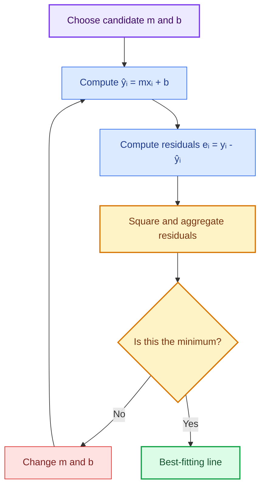
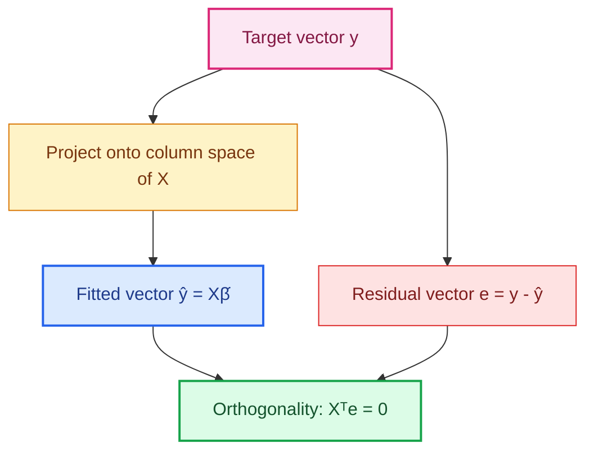
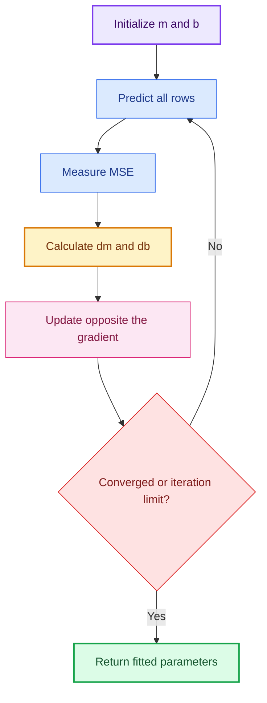
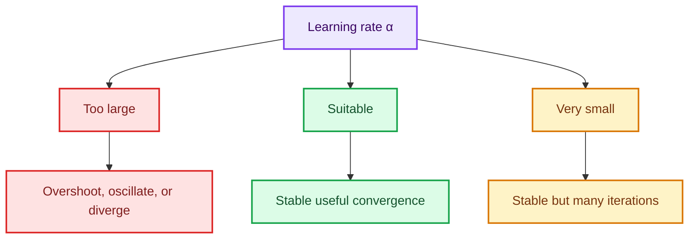
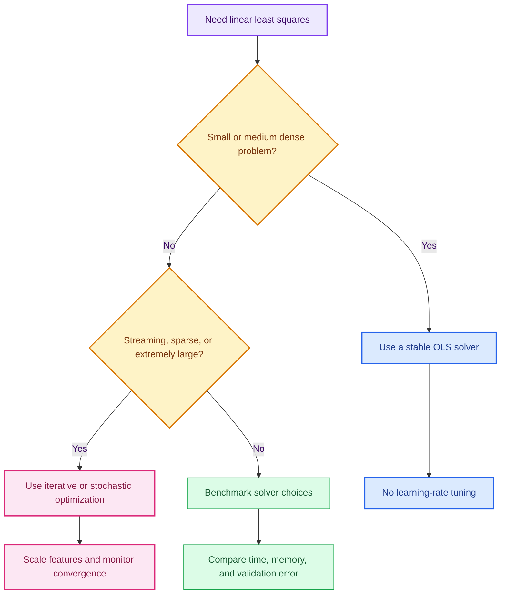

# 3. Simple Linear Regression — From Intuition to OLS and Gradient Descent

> Detailed notes based on `2 simpleLinearRegression.ipynb`. They preserve the notebook's example, derive the formulas it uses, explain every major code section, and replace fragile or misleading practices with safer alternatives.

<div class="note-card" markdown="1">
## 1. Learning goals

You should finish able to:

- interpret the slope, intercept, prediction, and residual;
- derive the closed-form OLS slope and intercept;
- explain why the fitted line passes through $(\bar x,\bar y)$;
- write the design-matrix form and explain why direct inversion is fragile;
- derive the gradient of MSE with respect to $m$ and $b$;
- perform one gradient-descent update by hand;
- explain the learning rate and feature scaling;
- distinguish Batch GD, SGD, and mini-batch GD;
- reconcile the notebook's full-data OLS and training-data GD values;
- implement both approaches with fully commented Python.
</div>

<div class="note-card" markdown="1">
## 2. The model: what it says

Simple linear regression uses one feature $x$ to model the conditional mean of a numerical target $Y$:

$$
E[Y\mid X=x]=\beta_0+\beta_1x.
$$

For an individual observation:

$$
y_i=\beta_0+\beta_1x_i+\varepsilon_i,
$$

and the fitted prediction is:

$$
\hat y_i=b+mx_i.
$$

| Symbol | Name | Meaning |
|---|---|---|
| $x_i$ | feature | observed input for row $i$ |
| $y_i$ | target | observed output |
| $\hat y_i$ | prediction | point on the fitted line |
| $m$ or $\hat\beta_1$ | slope | estimated target change per one-unit $x$ increase |
| $b$ or $\hat\beta_0$ | intercept | predicted target at $x=0$ |
| $\varepsilon_i$ | population error | unobserved deviation from the population line |
| $e_i$ | residual | observed deviation $y_i-\hat y_i$ |

### What does the slope mean?

$$
m=\frac{\Delta\hat y}{\Delta x}.
$$

If $m=2.92$, increasing $x$ by one unit changes the prediction by $2.92$ units:

$$
\hat y(x+1)-\hat y(x)=m.
$$

The units of $m$ are "target units per feature unit." If $x$ is floor area and $y$ is price, the slope is price per area unit.

### What does the intercept mean?

$$
b=\hat y(0).
$$

It is the line's vertical-axis crossing. It has a practical interpretation only if $x=0$ is meaningful and not unreasonable extrapolation.

### Why "simple"?

"Simple" means one predictor, not easy data, a small dataset, or an unimportant model.
</div>

<div class="note-card" markdown="1">
## 3. Geometric intuition

Every candidate pair $(m,b)$ defines a line. The best-fit rule compares those lines using the vertical gaps between each observed point and its fitted point.



For one observation:

$$
e_i=y_i-(mx_i+b).
$$

A point above the line has $e_i>0$: the prediction was too small.
A point below the line has $e_i<0$: the prediction was too large.

### Why vertical, not shortest, distances?

Ordinary regression treats $x$ as given and models randomness in $y$. If both axes contain substantial measurement error, the usual slope can be biased and orthogonal-distance or errors-in-variables methods may be preferable.

### Parameter-space intuition

The data plot lives in $(x,y)$-space. Optimization lives in $(m,b,J)$-space. Each point on the loss surface represents an entire candidate line.


</div>

<div class="note-card" markdown="1">
## 4. Residuals and the cost function

### Sum of squared errors

$$
\operatorname{SSE}(m,b)=\sum_{i=1}^{n}[y_i-(mx_i+b)]^2.
$$

### Mean squared error

$$
\operatorname{MSE}(m,b)=\frac1n\sum_{i=1}^{n}[y_i-(mx_i+b)]^2.
$$

### Half mean squared error

$$
J(m,b)=\frac{1}{2n}\sum_{i=1}^{n}[y_i-(mx_i+b)]^2.
$$

All three have the same minimizer because they differ only by positive constants. The factor $1/2$ is a calculus convenience: differentiating the square produces a $2$, which then cancels.

This distinction matters in code. The notebook's custom class calculates MSE with $1/n$, so its gradient correctly includes a factor of $2$. The markdown uses $1/(2n)$, whose gradient omits that factor. Both conventions are valid when loss and gradient are consistent.

### Why squared loss?

- Positive and negative residuals cannot cancel.
- A residual of 10 contributes $100$, while a residual of 1 contributes $1$.
- The objective is differentiable.
- The linear-regression loss is convex.

The sensitivity to large errors is both a feature and a weakness. If extreme observations are common or data errors occur, compare robust alternatives such as Huber or absolute-error regression.
</div>

<div class="note-card" markdown="1">
## 5. Deriving ordinary least squares

We minimize:

$$
J(m,b)=\sum_{i=1}^{n}[y_i-(mx_i+b)]^2.
$$

The positive scaling constant is omitted because it cannot change the minimizer.

### Step 1: differentiate with respect to $b$

$$
\frac{\partial J}{\partial b}=-2\sum_i[y_i-(mx_i+b)].
$$

Set it to zero:

$$
\sum_i y_i-m\sum_i x_i-nb=0.
$$

Divide by $n$:

$$
\bar y-m\bar x-b=0,
$$

so:

$$
\boxed{b=\bar y-m\bar x}.
$$

This immediately proves that the fitted OLS line passes through $(\bar x,\bar y)$:

$$
m\bar x+b=m\bar x+\bar y-m\bar x=\bar y.
$$

### Step 2: differentiate with respect to $m$

$$
\frac{\partial J}{\partial m}=-2\sum_i x_i[y_i-(mx_i+b)].
$$

After substituting $b=\bar y-m\bar x$ and collecting centered terms:

$$
\boxed{m=\frac{\sum_i(x_i-\bar x)(y_i-\bar y)}{\sum_i(x_i-\bar x)^2}}.
$$

Then:

$$
\boxed{b=\bar y-m\bar x}.
$$

### Statistical interpretation of the slope

Using sample covariance and variance with matching denominators:

$$
m=\frac{\operatorname{Cov}(X,Y)}{\operatorname{Var}(X)}=r_{xy}\frac{s_y}{s_x}.
$$

Consequences:

- If covariance is positive, slope is positive.
- If correlation is zero, the simple OLS slope is zero.
- Rescaling $x$ changes the numeric slope.
- If all $x_i$ are equal, the denominator is zero and slope cannot be identified.

### Worked example

Let:

$$
x=[1,2,3],\qquad y=[2,3,5].
$$

Then:

$$
\bar x=2,\qquad \bar y=\frac{10}{3}.
$$

$$
\sum(x_i-\bar x)(y_i-\bar y)=(-1)\left(-\frac43\right)+0+\left(\frac53\right)=3.
$$

$$
\sum(x_i-\bar x)^2=1+0+1=2.
$$

Therefore:

$$
m=\frac32=1.5,\qquad b=\frac{10}{3}-1.5(2)=\frac13.
$$

The fitted line is:

$$
\hat y=\frac13+1.5x.
$$

Predictions are approximately $[1.833,3.333,4.833]$; residuals are $[0.167,-0.333,0.167]$. Notice that residuals sum to zero.
</div>

<div class="note-card" markdown="1">
## 6. Matrix OLS and numerical stability

For multiple features, include a ones column in the design matrix:

$$
\tilde X=\begin{bmatrix}1 & x_{11} & \cdots & x_{1p}\\ 1 & x_{21} & \cdots & x_{2p}\\ \vdots & \vdots & \ddots & \vdots\\ 1 & x_{n1} & \cdots & x_{np}\end{bmatrix}.
$$

The model is:

$$
\hat y=\tilde X\boldsymbol{\beta}.
$$

The least-squares objective is:

$$
\lVert y-\tilde X\boldsymbol{\beta}\rVert_2^2.
$$

Differentiating:

$$
\nabla_{\boldsymbol{\beta}}J=-2\tilde X^\top(y-\tilde X\boldsymbol{\beta}).
$$

Setting it to zero gives the normal equations:

$$
\tilde X^\top\tilde X\hat{\boldsymbol{\beta}}=\tilde X^\top y.
$$

If invertible:

$$
\hat{\boldsymbol{\beta}}=(\tilde X^\top\tilde X)^{-1}\tilde X^\top y.
$$

### Why the notebook's direct inverse is educational but fragile

The notebook uses:

```python
beta = np.linalg.inv(X_bias.T @ X_bias) @ X_bias.T @ y
```

It mirrors the textbook formula, but production code should avoid forming the inverse because:

- floating-point roundoff is amplified;
- $X^\top X$ squares the condition number;
- exact multicollinearity makes it singular;
- near-collinearity makes coefficients unstable.

Prefer:

```python
beta, residual_sums, rank, singular_values = np.linalg.lstsq(
    X_bias,
    y,
    rcond=None,
)
```

Scikit-learn's dense `LinearRegression` wraps a stable least-squares solver rather than naïvely evaluating the explicit inverse.

### Projection intuition

OLS selects $\hat y$ as the projection of $y$ onto the column space of $X$. At the optimum:

$$
X^\top e=0.
$$

Thus residuals are orthogonal to every included feature column. If an intercept column is included:

$$
\mathbf{1}^\top e=\sum_i e_i=0.
$$


</div>

<div class="note-card" markdown="1">
## 7. Gradient descent from first principles

Gradient descent reaches the same OLS minimum iteratively.

Using MSE:

$$
J(m,b)=\frac1n\sum_i[y_i-(mx_i+b)]^2.
$$

Define:

$$
\hat y_i=mx_i+b,\qquad e_i=y_i-\hat y_i.
$$

The derivatives are:

$$
\frac{\partial J}{\partial m}=-\frac{2}{n}\sum_i x_i(y_i-\hat y_i),
$$

$$
\frac{\partial J}{\partial b}=-\frac{2}{n}\sum_i(y_i-\hat y_i).
$$

Updates:

$$
m_{\text{new}}=m_{\text{old}}-\alpha\frac{\partial J}{\partial m},
$$

$$
b_{\text{new}}=b_{\text{old}}-\alpha\frac{\partial J}{\partial b}.
$$

### Directional intuition

The gradient points in the local direction of fastest increase. Subtracting it moves downhill.



### One update by hand

Use the worked data $x=[1,2,3]$, $y=[2,3,5]$, start $m=b=0$, and use notebook-style MSE.

$$
\hat y=[0,0,0],\qquad e=[2,3,5].
$$

$$
\frac{\partial J}{\partial m}=-\frac23(1\cdot2+2\cdot3+3\cdot5)=-\frac{46}{3}\approx-15.333.
$$

$$
\frac{\partial J}{\partial b}=-\frac23(2+3+5)=-\frac{20}{3}\approx-6.667.
$$

At $\alpha=0.01$:

$$
m_{\text{new}}=0-0.01(-15.333)=0.1533,
$$

$$
b_{\text{new}}=0-0.01(-6.667)=0.0667.
$$

Both move toward the optimum $m=1.5,b=1/3$.

### Learning-rate behavior



The notebook diagram says a low learning rate "may get stuck." For convex linear least squares, "very slow" is the accurate intuition; local minima are not the issue.

### Why feature scaling helps GD

If one feature ranges from $0$ to $1$ and another from $0$ to $10^6$, the loss surface becomes elongated. A step size safe in the steep direction is inefficient in the flat direction. Standardization:

$$
z_j=\frac{x_j-\mu_j}{s_j}
$$

improves conditioning and allows more balanced updates. Fit $\mu_j$ and $s_j$ using training data only.

### Stopping criteria

Common rules:

- absolute loss change below a tolerance;
- gradient norm below a tolerance;
- parameter movement below a tolerance;
- validation loss stops improving;
- maximum iterations reached.

A tiny loss change can occur because the learning rate is tiny, so combining criteria is safer.
</div>

<div class="note-card" markdown="1">
## 8. Batch, stochastic, and mini-batch GD

| Aspect | Batch GD | SGD | Mini-batch GD |
|---|---|---|---|
| Rows per update | All $n$ | One | Small batch |
| Path | Smooth | Noisy | Moderately noisy |
| Update cost | High | Low | Moderate |
| Vectorization | Excellent | Weak | Excellent |
| Streaming | Poor | Excellent | Possible |
| Common use | Smaller convex problems | Online learning | Large modern training |

The notebook table labels Batch GD "high accuracy" and SGD "low/noisy." Noise describes the optimization path, not necessarily final predictive accuracy. With suitable schedules and enough updates, SGD can approximate the same optimum and sometimes generalize well.

An epoch means one full pass through the training data. Batch GD performs one update per epoch; SGD performs approximately $n$; mini-batch GD performs approximately $n/B$ updates for batch size $B$.
</div>

<div class="note-card" markdown="1">
## 9. OLS versus gradient descent



| Question | Stable OLS solver | Gradient descent |
|---|---|---|
| Exact finite-step linear algebra? | Yes, subject to floating point | No, iterative approximation |
| Learning rate? | No | Yes |
| Feature scaling essential? | Not for predictions, though conditioning matters | Strongly recommended |
| Huge/streaming data? | Often less convenient | Well suited |
| Rank deficiency? | SVD/lstsq can return a solution | Convergence and solution depend on setup |
| Convex global optimum? | Yes | Yes, with suitable optimization |

For the notebook's 100 rows and one feature, a stable OLS solver is the natural practical choice. The custom GD class is valuable for learning how optimization works.
</div>

<div class="note-card" markdown="1">
## 10. Notebook code walkthrough

### 10.1 Synthetic data

```python
np.random.seed(42)
X = np.random.rand(100, 1) * 10
y = 3 * X.squeeze() + 5 + np.random.randn(100) * 2
```

- The seed makes the exact random sequence reproducible.
- $X$ has 100 rows and one feature.
- `squeeze()` changes $(100,1)$ to $(100,)$.
- The hidden slope is 3 and intercept is 5.
- Noise prevents a perfect line and makes estimation realistic.

### 10.2 Scalar OLS function

The notebook's `ols_simple` follows the centered formulas exactly. A valuable guard would be:

```python
if np.isclose(denominator, 0):
    raise ValueError("Slope is undefined because x has no variation.")
```

### 10.3 Matrix OLS function

`np.c_[np.ones(...), X]` adds an intercept column. The order of returned coefficients is $[\text{intercept},\text{slope}]$. Replace `np.linalg.inv` with `np.linalg.lstsq` for numerical stability.

### 10.4 Train/test split

The custom GD model fits only `X_train` and `y_train`. Therefore it should be compared with OLS fitted on the same training data, not the earlier OLS result fitted on all 100 rows.

### 10.5 Gradient class

Important operations:

```python
y_pred = np.dot(X, self.weights) + self.bias
```
This vectorizes $\hat y=Xw+b$.

```python
dw = -(2/n_samples) * np.dot(X.T, (y - y_pred))
db = -(2/n_samples) * np.sum(y - y_pred)
```
These are the gradients of MSE. The updates subtract them.

One subtlety: the original class stores history before each update. After the final update, `self.weights` is one step ahead of the final stored history item. That difference is tiny here, but history should ideally record a consistent state.
</div>

<div class="note-card" markdown="1">
## 11. Improved commented implementation

### 11.1 Stable OLS functions

```python
import numpy as np

def ols_simple(x, y):
    """Fit y = m*x + b using centered simple-OLS formulas."""
    x = np.asarray(x, dtype=float).reshape(-1)
    y = np.asarray(y, dtype=float).reshape(-1)

    if x.size != y.size:
        raise ValueError("x and y must contain the same number of rows.")

    x_centered = x - x.mean()
    y_centered = y - y.mean()
    denominator = x_centered @ x_centered

    if np.isclose(denominator, 0.0):
        raise ValueError("Cannot estimate slope: x has no variation.")

    m = (x_centered @ y_centered) / denominator
    b = y.mean() - m * x.mean()
    return m, b

def ols_matrix(X, y):
    """Fit multiple OLS with an intercept using stable least squares."""
    X = np.asarray(X, dtype=float)
    y = np.asarray(y, dtype=float).reshape(-1)

    if X.ndim == 1:
        X = X.reshape(-1, 1)
    if X.shape[0] != y.size:
        raise ValueError("X and y must have the same number of rows.")

    design = np.column_stack([np.ones(X.shape[0]), X])
    beta, residual_sums, rank, singular_values = np.linalg.lstsq(
        design,
        y,
        rcond=None,
    )
    return beta, rank, singular_values
```

### 11.2 Improved educational gradient descent

```python
class GradientDescentLinearRegression:
    """Educational batch-gradient-descent linear regression."""

    def __init__(self, learning_rate=0.01, max_iter=10_000, tol=1e-8):
        self.learning_rate = learning_rate
        self.max_iter = max_iter
        self.tol = tol

    def fit(self, X, y):
        X = np.asarray(X, dtype=float)
        y = np.asarray(y, dtype=float).reshape(-1)

        if X.ndim == 1:
            X = X.reshape(-1, 1)
        if X.shape[0] != y.size:
            raise ValueError("X and y must have the same number of rows.")

        n_rows, n_features = X.shape
        self.coef_ = np.zeros(n_features)
        self.intercept_ = 0.0
        self.loss_history_ = []

        previous_loss = np.inf

        for iteration in range(self.max_iter):
            # Forward pass: prediction using current parameters.
            prediction = X @ self.coef_ + self.intercept_
            residual = y - prediction

            # MSE and its exact gradients under the same convention.
            loss = np.mean(residual ** 2)
            grad_w = -(2.0 / n_rows) * (X.T @ residual)
            grad_b = -(2.0 / n_rows) * residual.sum()

            # Move opposite the uphill gradient.
            self.coef_ -= self.learning_rate * grad_w
            self.intercept_ -= self.learning_rate * grad_b
            self.loss_history_.append(loss)

            # Reject divergence early instead of silently returning NaNs.
            if not np.isfinite(loss):
                raise FloatingPointError(
                    "Loss diverged; lower the learning rate or scale X."
                )

            # Stop after successive pre-update losses have stabilized.
            if abs(previous_loss - loss) < self.tol:
                self.n_iter_ = iteration + 1
                break

            previous_loss = loss
        else:
            self.n_iter_ = self.max_iter

        return self

    def predict(self, X):
        X = np.asarray(X, dtype=float)
        if X.ndim == 1:
            X = X.reshape(-1, 1)
        return X @ self.coef_ + self.intercept_
```

### 11.3 Reproduce the notebook comparison fairly

```python
from sklearn.linear_model import LinearRegression
from sklearn.model_selection import train_test_split

rng = np.random.RandomState(42)
X = rng.rand(100, 1) * 10
y = 3 * X[:, 0] + 5 + rng.randn(100) * 2

X_train, X_test, y_train, y_test = train_test_split(
    X, y, test_size=0.20, random_state=42
)

closed_form = LinearRegression().fit(X_train, y_train)
iterative = GradientDescentLinearRegression(
    learning_rate=0.01,
    max_iter=10_000,
).fit(X_train, y_train)

print("OLS:", closed_form.coef_[0], closed_form.intercept_)
print("GD: ", iterative.coef_[0], iterative.intercept_)

# They should be close because they optimize the same training objective.
print(
    "Maximum test prediction difference:",
    np.max(
        np.abs(
            closed_form.predict(X_test)
            - iterative.predict(X_test)
        )
    ),
)
```

For multiple differently scaled features, put `StandardScaler` and an iterative estimator in a `Pipeline`. Do not standardize the full dataset before splitting.
</div>

<div class="note-card" markdown="1">
## 12. Reading the outputs correctly

### Full-data OLS output

The notebook's scalar and matrix OLS code uses all 100 observations:

$$
\hat y=5.4302+2.9080x.
$$

Both functions match because they solve the same objective on the same rows.

### Training-only scikit-learn result

The notebook's earlier Regression example fits 80 training observations:

$$
\hat y=5.2858+2.9197x.
$$

### Training-only GD result after 1,000 iterations

$$
\hat y\approx5.2659+2.9228x.
$$

GD is close but not exactly equal after 1,000 iterations because it is an iterative approximation and the stopping tolerance was not reached. More iterations or feature scaling brings it closer.

| Method | Rows fitted | Slope | Intercept |
|---|---|---|---|
| Scalar OLS | 100 | 2.9080 | 5.4302 |
| Matrix OLS | 100 | 2.9080 | 5.4302 |
| scikit-learn OLS | 80 | 2.9197 | 5.2858 |
| Custom GD, 1,000 steps | 80 | 2.9228 | 5.2659 |

The main reason the first two differ from the latter two is different training data, not disagreement between algorithms.

The GD loss decreases from its initial value to about $3.3908$, essentially the training MSE. A log-scaled loss plot is useful because it reveals multiplicative improvement across a wide range.
</div>

<div class="note-card" markdown="1">
## 13. Assumptions, diagnostics, and boundaries

### Linearity
The conditional mean is assumed linear in $x$. A residual curve suggests missing structure.

### Independent or modeled dependence
Time series and repeated observations violate simple independence. Plot residuals in collection order and split appropriately.

### Constant variance
A funnel pattern implies heteroscedasticity. Coefficients may still be useful, but standard uncertainty formulas and constant-width intervals can fail.

### Exogeneity for unbiased coefficient interpretation

$$
E[\varepsilon\mid X]=0.
$$

Omitted variables related to both $x$ and $y$, reverse causation, selection, and measurement error can violate this.

### Normal residuals
Normality is not needed to compute OLS. It supports exact small-sample inferential procedures under the classical model.

### Interpolation versus extrapolation
A line predicts anywhere mathematically, but evidence is strongest within the observed $x$-range. A plausible relationship from $x=0$ to $10$ may be absurd at $x=1,000$.

### Point prediction versus uncertainty
`model.predict` gives a point estimate, not a prediction interval. A confidence interval for the mean response and a prediction interval for a new observation answer different questions; the latter is wider because it includes individual noise.
</div>

<div class="note-card" markdown="1">
## 14. Corrections and common traps

| Notebook idea or tempting practice | Refined version |
|---|---|
| GD starts with random values | It may, but the notebook initializes zeros |
| Low learning rate may get stuck | Convex OLS mostly becomes slow; it has no bad local minimum |
| Direct inverse gives OLS | Algebraically yes, but lstsq/SVD is safer |
| Inversion complexity is $O(n^3)$ | Distinguish $n$ samples from $p$ features |
| OLS fails under perfect correlation | Coefficients are non-unique; SVD can return a least-norm solution |
| Batch GD has high "accuracy," SGD low | Update noise and final predictive accuracy are different ideas |
| Full-data OLS and train-only GD should match | They must use the same rows before comparison |
| Final history point equals final parameter | Original history is stored before updates, so it is one step behind |
| Test data may guide iterations | Use training/validation for choices; preserve the test set |
| High $R^2$ proves the line is right | Check residuals, baselines, sampling, and domain validity |
</div>

<div class="note-card" markdown="1">
## 15. Practice questions with answers

- **What makes regression "simple"?** It has one predictor.
- **What is predicted by $\hat y=mx+b$?** The modeled conditional mean or point estimate of the target.
- **What are the units of $m$?** Target units per feature unit.
- **Why does the OLS line pass through $(\bar x,\bar y)$?** Because $b=\bar y-m\bar x$.
- **What happens if all $x_i$ are equal?** The slope denominator is zero, so slope cannot be identified.
- **Why square residuals?** Prevent cancellation, emphasize large misses, and obtain a smooth convex loss.
- **Does using $1/n$ versus $1/(2n)$ change the optimum?** No; it rescales the loss and gradient.
- **Why does MSE's gradient contain 2?** It comes from differentiating the squared residual.
- **Why subtract the gradient?** The gradient points uphill, so its negative points downhill.
- **Can OLS gradient descent be trapped in a bad local minimum?** Not for the ordinary convex linear least-squares objective.
- **Why scale features before GD?** It improves conditioning and balances gradient directions.
- **Why prefer lstsq over an inverse?** It is more stable and handles rank deficiency better.
- **Why do the notebook's OLS and GD coefficients differ?** OLS first uses all rows; GD uses the training subset, and GD is approximate.
- **What does a negative residual mean?** The prediction was too high.
- **Can a good line prove that $x$ causes $y$?** No.
- **For $m=3,b=5,x=4$, find $\hat y$.** $17$.
- **If $y=14$, find the residual.** $14-17=-3$.
- **For $x=[1,2,3]$, $y=[2,3,5]$, what are $m,b$?** $m=1.5$, $b=1/3$.
- **If $\partial J/\partial m=-8$, $m=1$, and $\alpha=0.1$, find the update.** $m_{\text{new}}=1-0.1(-8)=1.8$.
- **What happens when $\alpha$ is too high?** Updates can overshoot, oscillate, or diverge.

### Coding challenges

1. Add the zero-variance guard to the notebook's scalar OLS function.
2. Replace the direct inverse with `np.linalg.lstsq`.
3. Fit OLS and GD on the same rows and plot their lines together.
4. Standardize $X$, retrain GD, and compare iteration counts.
5. Try three learning rates and plot all loss curves.
6. Implement mini-batch updates with shuffled row indices.
7. Track gradient norm as an additional stopping criterion.
8. Add one high-leverage point and compare the fitted slope.
</div>

<div class="note-card" markdown="1">
## 16. Formula sheet and fun facts

| Concept | Formula |
|---|---|
| Model | $\hat y=mx+b$ |
| Residual | $e_i=y_i-\hat y_i$ |
| MSE | $J=\frac1n\sum e_i^2$ |
| Half MSE | $J=\frac1{2n}\sum e_i^2$ |
| OLS slope | $m=\frac{\sum(x_i-\bar x)(y_i-\bar y)}{\sum(x_i-\bar x)^2}$ |
| OLS intercept | $b=\bar y-m\bar x$ |
| Slope relation | $m=r_{xy}s_y/s_x$ |
| Matrix objective | $\min_\beta\lVert y-X\beta\rVert_2^2$ |
| Normal equations | $X^\top X\hat\beta=X^\top y$ |
| MSE slope gradient | $-\frac2n\sum x_i(y_i-\hat y_i)$ |
| MSE intercept gradient | $-\frac2n\sum(y_i-\hat y_i)$ |
| Update | $\theta_{t+1}=\theta_t-\alpha\nabla J(\theta_t)$ |

### Fun facts

- The OLS training residuals sum to zero when an intercept is included.
- Residuals are orthogonal to every fitted design-matrix column.
- In simple regression with an intercept, $R^2$ equals squared Pearson correlation.
- Centering $x$ makes the intercept equal to $\bar y$ and often improves numerical behavior.
- Multiplying the loss by a positive constant leaves the best line unchanged.
- An infinite number of lines exist, but convex least squares gives one global fitted-prediction solution; coefficient uniqueness depends on rank.
- Gradient descent can begin at zero because the squared linear loss has useful gradients there; random initialization is not required.
</div>

## Verified API references

- [scikit-learn: LinearRegression](https://scikit-learn.org/stable/modules/generated/sklearn.linear_model.LinearRegression.html)
- [scikit-learn: OLS and computational complexity](https://scikit-learn.org/stable/modules/linear_model.html)
- [scikit-learn: Regression metrics](https://scikit-learn.org/stable/modules/model_evaluation.html#regression-metrics)
