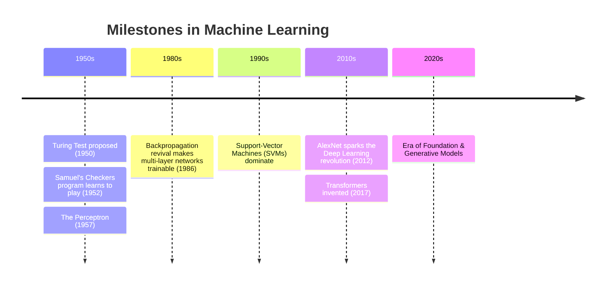

# 1. Machine Learning Foundation

> Detailed, curated, and enhanced study notes covering the absolute core fundamentals of Machine Learning.

<div class="note-card" markdown="1">
## Learning Outcomes
By the end of this module, you will understand:
- The paradigm shift from traditional programming to **Machine Learning**.
- How to separate AI, Machine Learning, and Deep Learning without relying on buzzwords.
- How to frame a real-world business objective into a machine learning problem.
- The mathematical foundations of how models learn, including **predictions**, **parameters**, and **loss**.
</div>

<div class="note-card" markdown="1">

## 1. What is Machine Learning?

### The Intuitive Definition
Machine Learning is the practice of building systems that **improve at a task by learning patterns from experience** (data) rather than being explicitly programmed.

**Traditional Programming:**
A developer writes explicit rules. If the rules break, the system breaks.
```text
Rules + Data ➔ Answers
```

**Supervised Machine Learning:**
We provide the system with examples, and the machine figures out the rules.
```text
Data + Known Answers ➔ Learned Model
Learned Model + New Data ➔ Predicted Answers
```

> [!TIP]
> **Example: Spam Detection**
> A traditional rule (`IF subject contains "free money" THEN spam`) is brittle. An ML model learns a combination of thousands of signals (word frequencies, sender reputation, structural quirks) to map observed features to an output.

### The Formal Definition (Tom Mitchell)
A computer program is said to learn from:
- **Experience** $E$
- with respect to **Task** $T$
- measured by **Performance Measure** $P$

...if its performance at $T$, measured by $P$, improves with experience $E$.

> [!NOTE]
> **Customer Churn Example:**
> - **Task $T$:** Predict whether a customer will cancel their subscription.
> - **Experience $E$:** Historical customer attributes and cancelation records.
> - **Performance $P$:** Recall, Precision, or overall business profit saved.

### The Mathematical View
Let:
- $\mathbf{x}_i \in \mathbb{R}^d$ be the **feature vector** for example $i$.
- $y_i$ be its **true target**.
- $f_{\theta}$ be a model controlled by learned **parameters** $\theta$.
- $\hat{y}_i = f_{\theta}(\mathbf{x}_i)$ be the **prediction**.
- $\ell(y_i,\hat{y}_i)$ be the **error** or **loss** for one example.

Training a model minimizes empirical risk (loss) across all examples.

</div>

<div class="note-card" markdown="1">

## 2. A Corrected History of Machine Learning

Understanding history helps you see that neural networks aren't a magical new invention; they are ideas from the 1940s and 50s that only recently gained enough data and compute power to thrive.



> [!IMPORTANT]
> The field advances when 5 ingredients align: **Algorithms**, **Massive Data**, **Compute (GPUs)**, **Fast Networking**, and **Economic Incentives**.
</div>

<div class="note-card" markdown="1">

## 3. AI vs ML vs Deep Learning

Artificial Intelligence is the broadest field. Machine Learning is a subset of AI, and Deep Learning is a highly specialized subset of Machine Learning.

```mermaid
flowchart TD
    AI["Artificial Intelligence<br>Broad field of intelligent systems"] --> ML["Machine Learning<br>Systems learning from experience"]
    AI --> O["Other AI<br>Search, logic, planning"]
    ML --> DL["Deep Learning<br>Multi-layer neural networks"]
    ML --> C["Classical ML<br>Trees, regression, clustering"]

    classDef glass fill:rgba(255,255,255,0.5),stroke:rgba(255,255,255,0.8),stroke-width:1px,color:#000;
    class AI,ML,DL,O,C glass;
```

### When to use what?

| Category | Typical Data | Interpretability | Examples |
|---|---|---|---|
| **Classical ML** | Structured, tabular data (SQL databases, spreadsheets) | Very high (e.g., decision trees) | Random Forests, XGBoost, Linear Regression |
| **Deep Learning** | Unstructured, complex data (Images, Audio, Text) | Opaque ("Black Box") | CNNs, Transformers (GPT), Deep Reinforcement Learning |

> [!TIP]
> **The Golden Rule:** Always start with Classical ML as a baseline. Only upgrade to Deep Learning if the performance gain justifies the massive increase in compute costs and latency.
</div>

---

# 4. Types of machine learning

<div class="note-card" markdown="1">

## 4. Types of Machine Learning

Machine Learning algorithms are categorized based on the amount and type of supervision they get during training. Here is a high-level map:

```mermaid
flowchart TD
    A["What feedback is available?"] --> B{"Correct answers provided?"}
    B -->|"Yes, many labels"| C["Supervised Learning"]
    B -->|"A few labels"| D["Semi-Supervised"]
    B -->|"No labels"| E["Unsupervised Learning"]
    A --> F{"Sequential actions & rewards?"}
    F -->|"Yes"| G["Reinforcement Learning"]

    classDef question fill:#fef3c7,stroke:#d97706,color:#78350f,stroke-width:2px;
    classDef supervised fill:rgba(37,99,235,0.2),stroke:#2563eb,color:#000,backdrop-filter:blur(4px);
    classDef unsupervised fill:rgba(124,58,237,0.2),stroke:#7c3aed,color:#000,backdrop-filter:blur(4px);
    classDef rl fill:rgba(219,39,119,0.2),stroke:#db2777,color:#000,backdrop-filter:blur(4px);
    
    class A,B,F question;
    class C,D supervised;
    class E unsupervised;
    class G rl;
```

### 4.1 Supervised Learning (Learning with a Teacher)
You feed the algorithm data (features) along with the known answers (labels). The model's job is to figure out the mathematical relationship between the two.

**Sub-types of Supervised Learning:**
1. **Regression:** Predicting a continuous *number*. (e.g., predicting the price of a house, temperature, or a customer's lifetime value).
   - *Example Algorithm:* Linear Regression ($\hat{y} = w_1x_1 + w_2x_2 + b$).
2. **Classification:** Predicting a *category* or *class*. (e.g., is this email spam or not? Is this tumor malignant or benign?).
   - *Example Algorithm:* Logistic Regression, Random Forest.

### 4.2 Unsupervised Learning (Learning without a Teacher)
The algorithm explores the data completely on its own to find hidden structures, patterns, or anomalies without any human-provided labels.

**Sub-types of Unsupervised Learning:**
1. **Clustering:** Grouping similar data points together. (e.g., segmenting your customers into distinct marketing personas).
   - *Example Algorithm:* K-Means.
2. **Dimensionality Reduction:** Compressing complex, high-dimensional data into a simpler form without losing the main signals.
   - *Example Algorithm:* Principal Component Analysis (PCA).
3. **Anomaly Detection:** Identifying outliers or weird behavior. (e.g., credit card fraud detection).

### 4.3 Reinforcement Learning (Learning via Trial & Error)
An **Agent** observes the **Environment**, takes an **Action**, and receives a **Reward** or penalty in return. Over time, it learns the best **Policy** to maximize its cumulative reward.
- *Examples:* Self-driving cars, teaching an AI to play chess, robot navigation.

</div>

<div class="note-card" markdown="1">

## 5. How Machine Learning Models are Trained

Training a model is essentially finding the best mathematical parameters that minimize the difference between the model's predictions and the actual truth.

### The Training Loop
```mermaid
flowchart TD
    A["1. Initialize Parameters randomly"] --> B["2. Forward Pass (Make Predictions)"]
    B --> C["3. Calculate Loss (Measure Error)"]
    C --> D["4. Calculate Gradients (Find Direction to improve)"]
    D --> E["5. Update Parameters (Take a step)"]
    E --> F{"Is Error low enough?"}
    F -->|"No"| B
    F -->|"Yes"| G["Done! Model is trained."]

    classDef glass fill:rgba(255,255,255,0.3),stroke:rgba(255,255,255,0.6),color:#000,backdrop-filter:blur(4px);
    class A,B,C,D,E,F,G glass;
```

### Key Training Concepts
- **Loss Function (Cost Function):** A mathematical way to measure how wrong the model is. (e.g., Mean Squared Error for regression, Cross-Entropy for classification).
- **Gradient Descent:** The optimization algorithm used to minimize the loss. It calculates the slope (gradient) of the loss function and updates the parameters in the opposite direction.
- **Learning Rate ($\eta$):** The size of the step the model takes during gradient descent. If it's too high, the model overshoots the minimum; if it's too low, training takes forever.
- **Epoch:** One complete pass through the entire training dataset.
- **Batch Size:** The number of examples the model looks at before updating its parameters.

### Parameters vs. Hyperparameters
| Concept | Definition | Examples |
|---|---|---|
| **Parameters** | Internal variables the model learns *by itself* during training. | Neural network weights, Regression coefficients. |
| **Hyperparameters** | Settings *you (the human)* configure before training begins. | Learning rate, Batch size, Tree depth. |

</div>

<div class="note-card" markdown="1">

## 6. Evaluation Metrics

A model with 99% accuracy sounds great, until you realize that 99% of your data belongs to one class, and the model simply predicts that class every time. Choosing the right metric is critical.

### 6.1 Classification Metrics

| Metric | Formula | What it means | When to use it |
|---|---|---|---|
| **Accuracy** | $\frac{TP + TN}{\text{Total}}$ | Overall, how often is the model correct? | When classes are balanced and all errors cost the same. |
| **Precision** | $\frac{TP}{TP + FP}$ | When it predicts "Yes", how often is it actually "Yes"? | When **False Positives** are very costly (e.g., Spam detection). |
| **Recall (Sensitivity)** | $\frac{TP}{TP + FN}$ | Out of all actual "Yes" cases, how many did we catch? | When **False Negatives** are very costly (e.g., Cancer screening). |
| **F1 Score** | $2 \cdot \frac{\text{Precision} \cdot \text{Recall}}{\text{Precision} + \text{Recall}}$ | The harmonic mean of Precision and Recall. | When you need a balance between Precision and Recall, especially on imbalanced datasets. |

> [!WARNING]
> **Data Leakage:** Be incredibly careful that your model doesn't "cheat" by having access to the target variable or future information during training. For example, predicting who will buy an umbrella using a feature called "is_carrying_umbrella".

### 6.2 Classification Confusion Matrix

A confusion matrix helps visualize the performance of a classification model by showing the exact breakdown of correct and incorrect predictions.

| | **Predicted Positive** | **Predicted Negative** |
|---|---|---|
| **Actual Positive** | True Positive (TP) | False Negative (FN) |
| **Actual Negative** | False Positive (FP) | True Negative (TN) |

- **True Positive (TP):** We predicted "Yes", and they actually *were* "Yes".
- **True Negative (TN):** We predicted "No", and they actually *were* "No".
- **False Positive (FP):** We predicted "Yes", but they were actually "No" (Type I Error).
- **False Negative (FN):** We predicted "No", but they were actually "Yes" (Type II Error).

### 6.3 Regression Metrics

- **MAE (Mean Absolute Error):** The average absolute difference between the predicted and actual values. It is highly interpretable (same units as the target).
  - **Formula:** $\text{MAE} = \frac{1}{n} \sum_{i=1}^{n} |y_i - \hat{y}_i|$
- **RMSE (Root Mean Squared Error):** Heavily penalizes large errors because the errors are squared before averaging. Use this when massive mistakes are unacceptable.
  - **Formula:** $\text{RMSE} = \sqrt{\frac{1}{n} \sum_{i=1}^{n} (y_i - \hat{y}_i)^2}$
- **Coefficient of determination ($R^2$):** Measures the proportion of variance in the dependent variable that is predictable from the independent variables.
  - **Formula:** $R^2 = 1 - \frac{\sum (y_i - \hat{y}_i)^2}{\sum (y_i - \bar{y})^2}$
  - $R^2 = 1$: **Perfect predictions** on the evaluated data.
  - $R^2 = 0$: **No improvement** over just predicting the average (mean) of the data.
  - $R^2 < 0$: **Worse** than just guessing the average.

> [!IMPORTANT]
> A high **$R^2$** does not mean your model is necessarily "good", fair, or establishing causality. It simply means it fits the current data well.

</div>

<div class="note-card" markdown="1">

## 7. Online vs. Batch Learning

How does your model learn when new data is constantly flowing in?

### Batch (Offline) Learning
The model is trained on a massive, fixed snapshot of data. If you want it to learn from new data, you have to retrain the *entire* model from scratch on the old + new data.
- **Pros:** Simple, stable, easy to evaluate.
- **Cons:** Very slow to adapt, requires massive computing power to retrain often.

### Online Learning
The model is updated incrementally as new data arrives (either one by one, or in small "mini-batches").
- **Pros:** Fast adaptation to new trends (e.g., stock market, fraud patterns), requires less memory.
- **Cons:** Tricky to maintain. If bad data flows in, the model can quickly degrade.

#### Data Drift vs Concept Drift
- **Data Drift:** The input data changes (e.g., users switch from desktops to mobile phones).
- **Concept Drift:** The fundamental relationship between inputs and outputs changes (e.g., what considered a "luxury" house 20 years ago vs today).

</div>

<div class="note-card" markdown="1">

## 8. Instance-based vs. Model-based Learning

How does the algorithm actually "know" the answer to a new problem?

### Instance-based Learning (Lazy Learning)
The system simply memorizes the training data. When it sees a new data point, it looks at the stored examples and finds the closest match using a similarity measure.
- **Analogy:** Solving a math problem by finding an identical one you solved before and copying the answer.
- **Example Algorithm:** K-Nearest Neighbors (KNN). 
- **Pros:** Fast to "train" (just store data).
- **Cons:** Very slow to predict (must compare against all stored data), uses massive memory.

### Model-based Learning (Eager Learning)
The system doesn't memorize the data. Instead, it studies the data to find underlying rules, patterns, or mathematical equations. It builds a *model* and discards the raw data.
- **Analogy:** Actually learning the mathematical formulas so you can solve *any* new problem without looking at past examples.
- **Example Algorithm:** Linear Regression, Neural Networks.
- **Pros:** Extremely fast to predict, uses very little memory.
- **Cons:** Can be slow and complex to train.

</div>

---

# 9. Major challenges in machine learning

<div class="note-card" markdown="1">

## 9. Major Challenges in Machine Learning

Machine Learning isn't magic. If you feed it garbage, it will output garbage. Here are the biggest hurdles:

### 1. Data Quality & Quantity
- **Insufficient Data:** Complex models (like Deep Learning) require massive amounts of data to learn properly.
- **Poor-Quality Data:** Missing values, duplicates, outliers, and incorrect labels will derail any algorithm.
- **Non-Representative Data:** If your training data doesn't represent the real world, your model won't either. This leads to **Sampling Bias** (e.g., training a self-driving car only in sunny California and deploying it in snowy Canada).

### 2. Overfitting (Memorizing instead of Learning)
The model learns the training data *too well*, including the random noise. It performs beautifully on training data but fails miserably on new, unseen data.
- *Solution:* Simplify the model, get more training data, or use Regularization (penalizing complexity).

### 3. Underfitting (Too Simple)
The model is too simple to learn the underlying patterns in the data. It performs poorly on both training and new data.
- *Solution:* Use a more powerful model or feed it better, more relevant features.

</div>

<div class="note-card" markdown="1">

## 10. Revision Flashcards 🧠

Test your knowledge! Hover or think of the answer before checking.

- **Q: What is Supervised Learning?**
  - *A: Learning from data that has the correct answers (labels) provided.*
- **Q: What is the difference between Regression and Classification?**
  - *A: Regression predicts a continuous number; Classification predicts a category/class.*
- **Q: What is Unsupervised Learning?**
  - *A: Finding hidden patterns in unlabeled data (e.g., Clustering).*
- **Q: What does Reinforcement Learning optimize?**
  - *A: The cumulative reward of an Agent taking actions in an Environment.*
- **Q: What is Overfitting?**
  - *A: When a model memorizes the training data noise and fails to generalize to new data.*
- **Q: Difference between Parameters and Hyperparameters?**
  - *A: Parameters are learned by the model during training; Hyperparameters are set by the human beforehand.*
- **Q: What is Data Leakage?**
  - *A: Accidentally giving the model access to information during training that it wouldn't have in the real world.*
- **Q: When should you use Recall instead of Precision?**
  - *A: When False Negatives are highly dangerous or costly (e.g., missing a cancer diagnosis).*

</div>